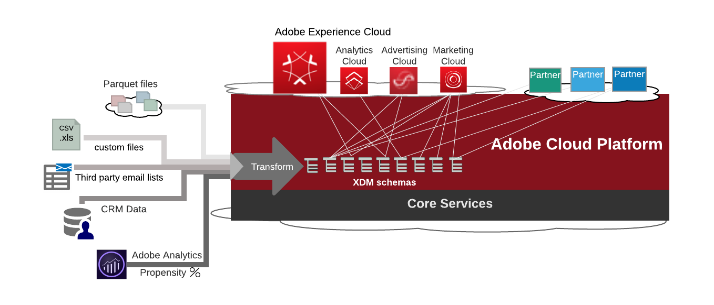
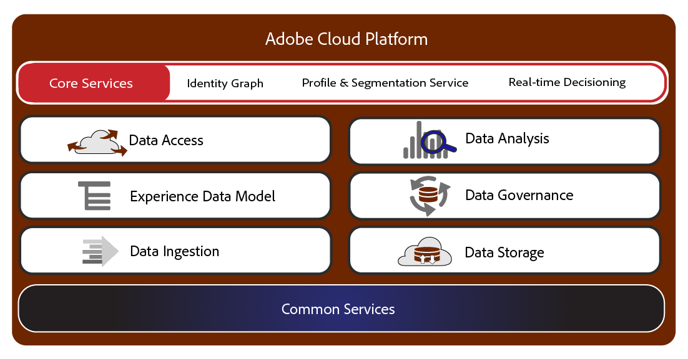
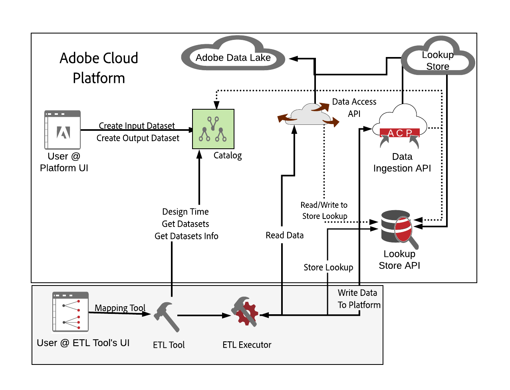
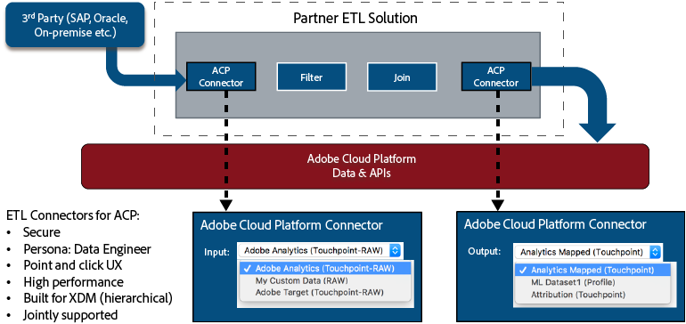
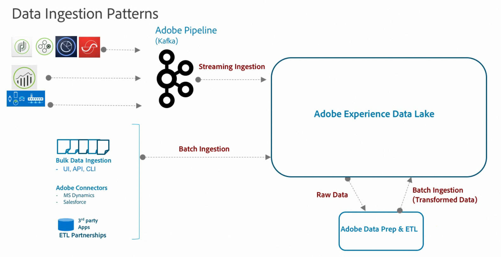
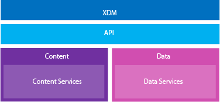
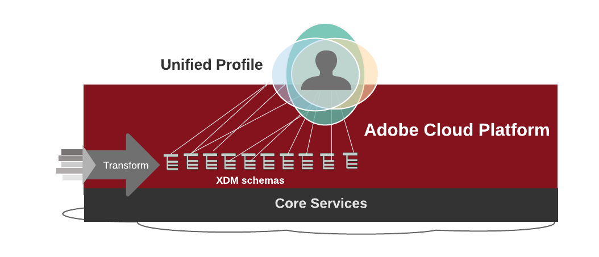

**Beta Release**

**Adobe Cloud Platform**

Updated on March 20th 2018

Adobe Cloud Platform Technical Overview
=============================

The Adobe Cloud Platform (ACP) furnishes market analysts and their solution developers with a common data foundation, a common data language, end-to-end workflows for business users, and shared API services for developers to build integrated Adobe and partner solutions. As a customer data platform, the ACP ingests, transforms, and unifies customer data from all types of marketing, sales, and service channels, and then maps the data from multiple channels to standard or custom modeling schemas using the Experience Data Model (XDM). This semantic data layer structures your data for access across all Adobe and parnter applications and services. It allows you to develop workflows with a directed, responsive, and personalized experience.

The Adobe Cloud Platform delivers a Unified Profile for a single customer view, derived from ingested Adobe, third-party, and streaming solution datasets and structured into defined schemas in the Experience Data Model (XDM). The Adobe Experience Cloud and other Adobe clouds, as well as partner solutions, run on the ACP as a unified system. The ACP synthesizes all types of data allowying you to deploy and develop solutions on a cohesive infrastructure where the whole is greater than the sum of its parts.

## Components of the Adobe Cloud Platform
The Adobe Cloud Platform includes the following independent components for a comprehensive extract/transform/load (ETL) process and other comprehensive platform features:

The components of ACP are independent systems that can be included and applied to an implementation of the Adobe Cloud Platform.

**Data ingestion** includes UI steps and APIs for batch and streaming services using APIs and SDKs, Extract/Transform/Load (ETL) processes, CRM connectors (such as Microsoft Dynamics and Salesforce connectors), and other processes to define and pull data in to the platform. After ingestion of datasets, you can then map the data to a profile.

**Experience Data Model (XDM)** is the common language employed across the Adobe Cloud Platform for all Adobe marketing and partner solutions. This standardized, canonical data model lets customers, Adobe solutions, and partner solutions employ commonly formatted data in defined schemas. XDM identifies the type of structured semantic data needed for customers and partners to share information across solutions and services.

XDM allows data to flow freely through systems and ensures repeatable implementations of the Experience Cloud. The XDM supports all aspects of the ACP, including schema creation, data ingestion, dataset management, machine learning, scoring, and intelligent services. In addition, XDM also supports a Unified Profile, the Experience Data Warehouse, omni-channel experiences, and support for all commerce activities.

**AI Studio** using machine learning allows you to extend your expertise and standardize analysis to all parts of your marketing ecosystem.

**Data Storage** on the ACP includes two types of data storage: The Adobe Data Lake where persistent data resides and is managed by the Adobe Data Lake and services (ADLS), and a
- The ACP Lookup store.

The ADLS sits on the Microsoft Azure Data Lake and integrates and extends these services. The Data Storage component is a single repository of Adobe, partner, and third-party datasets.

**Data Governance** allows you to label data to support GDPR regulations and define data for other advanced use cases.

**Data Access** component loads outbound data for solutions and services running on the ACP. Data Access is a self-service approach for solutions running on the ACP to access outbound data using APIs and SDKs.

**Data Analysis** employs machine learning features, real-time and batch data reporting, and analytical features to identify, profile, and segment for targeted campaigns or who to attribute for eventual conversion of sales.

**Core services** let you segment audiences, build profiles, and respond to real-time events across all components. 

## Deploying Adobe Cloud Platform Components
The ACP components are independent and implemented based on your needs and architecture.

The following is the basic workflow for setting up data on the Adobe Cloud Platform. It performs the basic ETL (Extract/Transform/Load) and supporting processes using ACP components.

### Profile and Identity on the Adobe Cloud Platform
The Adobe Cloud Platform includes both Identity Services (IDS) and a comprehensive Unified Profile service. Identity services captures all relevant public identities and associations for a person, and the profile combines attributes of that person, including the identity relationships, to build a Unified Profile.

For example, the Identity Services know that dude@letsroll.com also has an email account at letsgoroll@yahoo.com. The Identity Services will connect the two. When dude@letsroll.com is accessed, the profile services will call the identity services to find out that letsgoroll@yahoo.com is the same person. Then the profile services will merge the two profile fragments and return a Unified Profile.

### DULE for GDPR
Data Usage Labeling and Enforcement (DULE) from Adobe lets you to label and manage your data as needed, including compliance with General Data Protection Regulation (GDPR) established in the EU. Data governance encompasses the strategies and technologies used to apply policies and to control access to data, to track changes to datasets, and to ensure data usage is in compliance with regulations, contract terms, and corporate policies.

The main functionalities of DULE are:

* Data Usage Labeling
 - Allows users to label data based on their governance and compliance needs.
* Data Access Policies and Enforcement
 - Allows users to set data usage policies for enforcement

### ETL Connectors for Partners

Partners are key to the success of the Adobe Cloud Platform (ACP), and the
[Adobe Exchange
program](https://partners.adobe.com/exchangeprogram/experiencecloud.html)
assists with varying levels of partner integration through multiple benefit packages, including ACP with the ETL Ecosystem. To support Adobe Exchange partners participating in the ETL Ecosystem program, Adobe and their partners can create premium ETL connectors to integrate with the Adobe Cloud Platform.

### AI Studio
The emergence of machine learning allows you to derive insights and intelligence from website analytics, off-line consumer and point-of-sale data, CMS data, email responses, back-end systems, and across all cross-channel marketing data. Using machine learning, you can enact policies for real-time decisioning.

### Ingesting Data
The Adobe Cloud Platform provides common Extract/Transform/Load (ETL) capabilities. It provides tools to ingest data, transform multiple data to the appropriate XDM schemas, and enrich and standardize data for use by apps and services.

Data ingestion comes in two forms: Streaming ingestion and Batch ingestion. Both can be done from the ACP user interface, and the Batch Ingestion API allows you to customize your batch ingestion process. A CLI interface allows you to build jobs to send datasets to the platform. In addition, connectors for CRM systems like MS Dynamics and Salesforce allow for seamless ingestion.

There are two approaches for data ingestion and transform:

**The ACP Eco-system Approach.** This is a general approach to support a broader ETL ecosystem through APIs and a certification program. The ACP provides a partner-managed ETL service and focuses on MS Azure implementations for greater scalability and improved costs. The general API ecosystem approach improves scalability by providing native support for Spark jobs.

Data integration starts with ingesting and streaming datasets from multiple channels: CRM data with personal and demographic information, POS from in-person  and online transactions, and integrated mobile device data. It can include data from flat files, streaming data, data shared from Microsoft's Common Data Model (CDM), and data already standardized in Adobe's Experience Data Model (XDM) schemas.

Data ingestion on the ACP is designed to be standardized and centralized to allow for quick ingestion of all types of data and different latencies across the organization--real-time or enhanced data from a data lake.

The goal is to have all Adobe solutions--Adobe Analytics, Target, Campaign, and partners--to stream data through the pipeline into the platform. If a customer is provisioned for the platform, then all data will be ingested and transformed to XDM schemas as part of the platform automatically. When you log in to the platform all of your data will appear.

**Adobe and Partners.** Adobe provides an optimized experience and deeper ETL integration between Adobe and its partner using the [Adobe Exchange
program](https://partners.adobe.com/exchangeprogram/experiencecloud.html). This program allows Adobe and its partner to build a customer user interface (or use a standard template) and perform ETL tasks for a direct ingestion of customer datasets.

These capabilities include

- single sign-on
- simplified workflows
- job creation, orchestration, and monitoring
- pre-defined templates

### Transforming data
After bringing data  in to the platform, you need to transform the diverse fields to XDM schemas by mapping the customer data fields to XDM fields using a third-party application such as snapLogic, Informatica, Unifi, or TMMData.

### Using the Unified Profile

Structuring your data as XDM semantic content then lets you build a comprehensive profile with rich content, allowing you to segment data and target audiences, or attribute purchasing decisions based on visits, timestamped dates, conversions, and across devices.

In the Adobe Cloud Platform, you first define your required XDM schemas (standard and custom), and then populate the schemas by ingesting CSV or Parquet files, streaming solution data, and integrating with third-party platform connectors.

### Understanding Profile and Identity on ACP
The Adobe Cloud Platform includes both Identity Services (IDS) and a comprehensive Unified Profile service. Identity services captures all relevant public identities and associations for a person, and the profile combines attributes of that person, including the identity relationships, to build a Unified Profile.

For example,
The IDS knows that dude@letsroll.com also has an email account at letsjustroll@yahoo.com. The Identity Services will connect the two.

When dude@letsroll.com is accessed, the profile services will call the identity services to find out that letsjustroll@yahoo.com is the same person. Then, the profile services will merge the two profile fragments and return a Unified Profile.

### Using DULE for GDPR
Data Usage Labeling and Enforcement (DULE) from Adobe General allows you to label and manage your data as needed, including compliance with General Data Protection Regulation (GDPR) established in the EU. Data governance encompasses the strategies and technologies used to apply policies and to control access to data, to track changes to datasets, and to ensure data usage is in compliance with regulations, contract terms, and corporate policies.
The main functionalities of DULE are:

* Data Usage Labeling
 - Allows users to label data based on their governance and compliance needs.
* Data Access Policies and Enforcement
 - Allows users to set data usage policies for enforcement

 Here's the basic workflow for 
